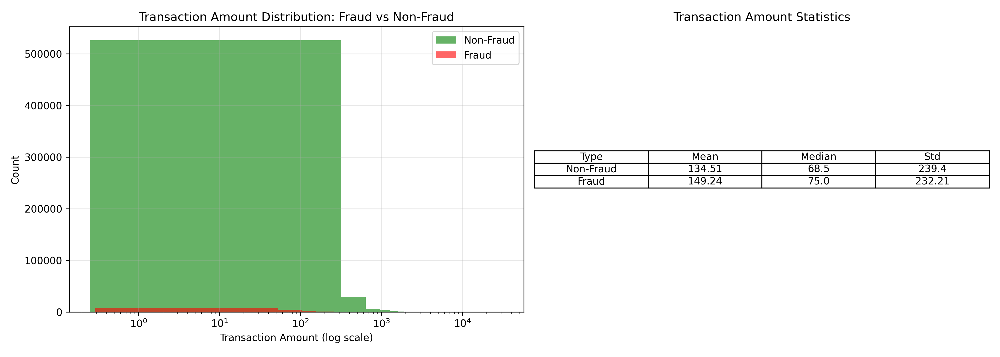
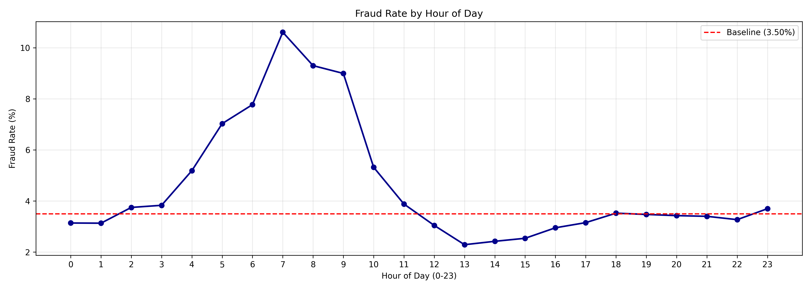
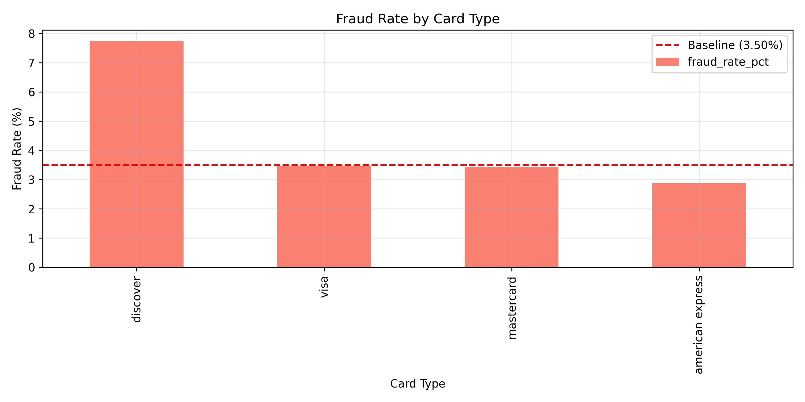
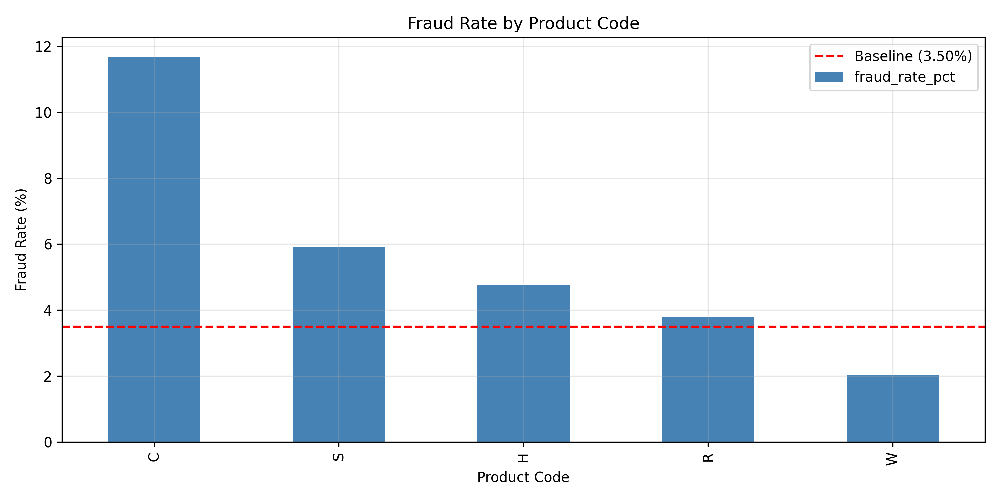
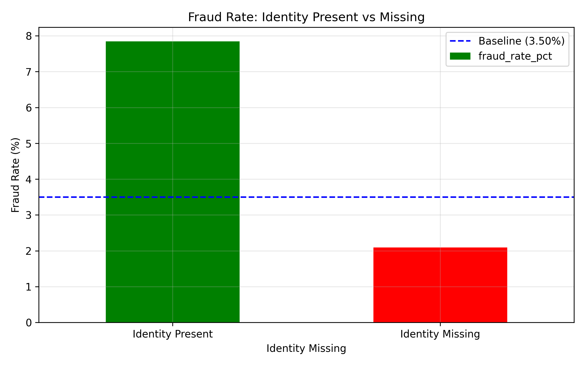
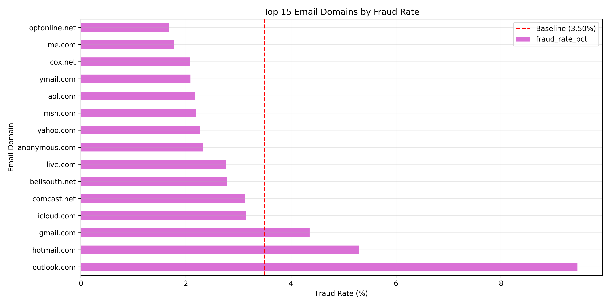
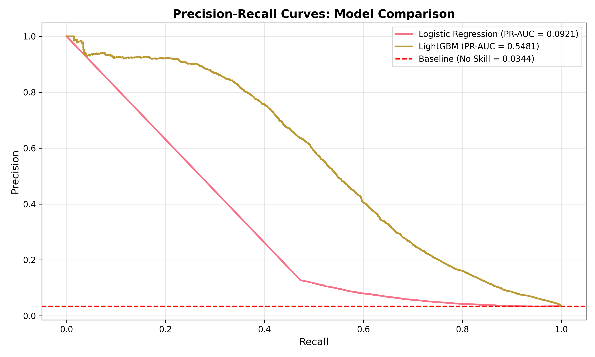
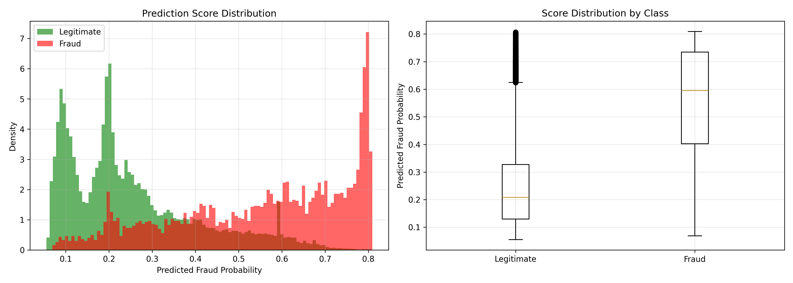

# End-to-End Fraud Risk Scoring System  


[](https://www.python.org/)
[](https://lightgbm.readthedocs.io/)
[](https://numpy.org/)
[](https://pandas.pydata.org/)
[](https://matplotlib.org/)
[](https://seaborn.pydata.org/)
[](https://scikit-learn.org/)
[](https://www.statsmodels.org/)
[](LICENSE)

---

## Project Overview

This repository demonstrates a **full-lifecycle, regulator-safe machine learning system** for **transaction fraud detection**, designed to meet the standards of **financial services, healthcare payments, insurance, and other regulated industries**.

Unlike typical ML portfolios that stop at model accuracy, this project delivers:

- Business-aligned fraud risk scoring
- Cost-optimized threshold governance
- Temporal validation and stability testing
- Deployment readiness and monitoring design
- Formal **Model Risk Management (SR 11-7–style)** governance
- **Human-in-the-loop decision control**

> **Positioning:**  
> This work reflects the level expected from a **Principal / Lead ML Consultant**, not an academic or competition-based project.

---

## Business Problem

Organizations processing high-volume transactions face:

- Extreme class imbalance (≈3–4% fraud)
- High cost of false negatives (missed fraud)
- Limited manual review capacity
- Regulatory and audit scrutiny
- Operational risk from over-automation

### Objective

1. Maximize fraud dollars prevented  
2. Control false positives and analyst workload  
3. Prevent automated adverse actions  
4. Maintain auditability, explainability, and governance  
 

---

## Solution Summary

| Component | Design Choice |
|---------|--------------|
| Model | LightGBM (class-weighted) |
| Output | Continuous fraud risk probability |
| Decision Role | Decision Support ONLY |
| Automation | Semi-automated (human approval required) |
| Optimization | Business cost-based thresholds |
| Governance | SR 11-7–aligned Model Risk Framework |

---

## Exploratory Risk Insights (Business-Relevant)

### Fraud Rate by Transaction Amount


**Interpretation**
- Fraud rate increases non-linearly with transaction amount
- Justifies stronger model weighting for high-value transactions
- Direct input into cost-based threshold optimization

---

### Fraud Rate by Hour of Day


**Interpretation**
- Clear temporal risk patterns observed
- Supports inclusion of time-based features
- Operational insight: staffing alignment for manual review teams

---

### Fraud Rate by Card Type


**Interpretation**
- Certain card types exhibit elevated fraud risk
- Must be handled carefully to avoid proxy bias
- Used for risk scoring, **not rule-based decisions**

---

### Fraud Rate by Product Code


**Interpretation**
- Product-level risk heterogeneity detected
- Valuable for fraud ops prioritization
- Avoids hard-coded rules; model learns patterns instead

---

### Identity Presence vs Missing


**Interpretation**
- Missing identity signals materially higher fraud risk
- Strong justification for identity completeness monitoring
- Operational dependency flagged in Model Risk Register

---

### Top Email Domains by Fraud Rate


**Interpretation**
- Concentrated fraud risk in specific domains
- High leakage risk if misused → model-only usage enforced
- Explicitly prohibited for rule-based blocking

---

## Model Training & Feature Importance

### Top 20 Feature Importances (LightGBM)
.png)

**Interpretation**
- Mix of behavioral, temporal, and transaction features
- No single feature dominates → reduced leakage risk
- Supports model robustness and audit defensibility

---

## Model Performance & Validation

### Precision–Recall Curve Comparison


**Interpretation**
- LightGBM dominates baseline models across recall range
- PR-AUC selected due to class imbalance
- Model chosen based on **business utility**, not ROC alone

---

### Prediction Score Distribution by Class


**Interpretation**
- Strong separation between fraud and legitimate transactions
- Statistical significance confirmed (p < 0.001)
- Enables stable threshold-based decisioning

---

## Temporal Validation & Stability (Notebook 07)

| Metric | Value |
|------|------|
| Validation PR-AUC | **0.4268** |
| Train PR-AUC | 0.5021 |
| Overfitting Gap | 15.0% |
| PSI | 0.0143 (Stable) |
| Temporal CV | 12.6% |

**Conclusion**  
No data leakage, stable population, acceptable temporal variability for fraud domain.

---

## Business Threshold Optimization

### Flagging Rate vs Threshold


**Interpretation**
- Explicit trade-off between recall and operational capacity
- Enables governance-approved thresholds
- Prevents “model decides everything” failure mode

---

### Approved Thresholds

| Policy | Threshold | Flag Rate | Recall |
|------|----------|----------|-------|
| Conservative | 0.7428 | 1% | 23.4% |
| Balanced | 0.6019 | 5% | 48.9% |
| Aggressive | 0.5268 | 10% | 60.9% |

Optimal business value achieved at **Aggressive (90%)** threshold.

---

### Cost-Based Decisioning

| Threshold | Net Benefit |
|---------|-------------|
| Conservative | –$1.09M |
| Balanced | –$0.16M |
| **Aggressive (Optimal)** | **+$185,865** |

**Key Insight:**  
Optimal fraud systems maximize **business value**, not precision alone.

---

## Human-in-the-Loop Design (Mandatory)

| Function | Automation |
|-------|-----------|
| Risk Scoring | Automated |
| Case Prioritization | Automated |
| Fraud Decision | **Human Analyst** |
| Blocking / Reversal | **Human Only** |

- Analyst overrides tracked
- Override rates monitored
- Feedback loop into retraining

---

## Deployment & Monitoring (Notebook 08)

- Shadow mode → pilot → phased rollout
- Real-time monitoring: PR-AUC, PSI, latency
- Business KPIs: fraud dollars prevented, FP cost
- Incident response & rollback defined


### Deployment Readiness

**Overall Readiness Score:** **85%**  
✅ Approved for **Phase 0 (Shadow Mode)**

| Phase | Traffic | Description |
|----|--------|-------------|
| Phase 0 | 0% | Logging only |
| Phase 1 | 10% | Conservative threshold |
| Phase 2 | 50% | Balanced threshold |
| Phase 3 | 100% | Full production |

---

## Production Monitoring

| Category | Metric | Alert |
|-------|-------|------|
| Performance | PR-AUC | < 0.38 |
| Drift | PSI | > 0.25 |
| Ops | Latency p95 | > 500ms |
| Business | Fraud $ Prevented | < $300K/month |

---

## Model Risk & Governance

- Overall Risk Level: **MEDIUM–HIGH**
- Materiality: **High ($6M+ exposure)**
- Governance: **SR 11-7–style**
- 8 risks identified, all mitigated or controlled
- Full model card, risk register, incident response plan included

---

## Regulatory Alignment

| Framework | Status |
|--------|--------|
| SR 11-7 (Model Risk) | ✅ Compliant |
| PCI-DSS | ✅ Compliant |
| SOX | ✅ Compliant |
| GDPR / CCPA | ⚠ Partial (explainability implemented) |
| FCRA | N/A (not a credit model) |

---

## Disclaimer & Intended Use

### Disclaimer
This project is for **demonstration and portfolio purposes only**.  
It is **not a production system** and must not be used without independent validation, security review, and governance approval.

### Intended Use
✔ Fraud risk scoring  
✔ Analyst decision support  
✔ Case prioritization  

### Prohibited Use
✗ Automated transaction blocking  
✗ Automated account closure  
✗ Credit scoring or lending decisions  
✗ Medical diagnosis or clinical decision-making  

---

## How to Run

```bash
git clone https://github.com/your-username/fraud-risk-scoring
cd fraud-risk-scoring
pip install -r requirements.txt
```

> **Run this book in order**  
- 01_data_preparation.ipynb  
- 02_feature_engineering.ipynb  
- 03_model_training.ipynb  
- 04_evaluation.ipynb  
- 05_threshold_optimization.ipynb  
- 06_business_approval.ipynb  
- 07_model_validation.ipynb  
- 08_deployment_monitoring.ipynb  
- 09_model_risk_governance.ipynb  

---

## Repository Structure
```
├── notebooks/
│   ├── 01–06: Modeling & Threshold Optimization
│   ├── 07: Validation & Stability
│   ├── 08: Deployment & Monitoring
│   └── 09: Model Risk & Governance
├── models/
│   ├── model.pkl
│   ├── thresholds.json
│   └── model_card.json
├── reports/
│   └── Fraud_Risk_Scoring_Executive_Report.pdf
├── visuals/
│   ├── transaction_amount_risk_analysis.png
│   ├── fraud_rate_by_hour_of_day.png
│   ├── fraud_rate_by_card_type.png
│   ├── fraud_rate_by_product_code.png
│   ├── fraud_rate_identity_present_vs_missing.png
│   ├── top_15_email_domains_by_fraud_rate.png
│   ├── top_20_features_importance(lightGBM).png
│   ├── precision_recall_curves_model_comparison.png
│   ├── score_distribution_by_class.png
│   └── transaction_flagging_rate.png
├── LICENSE
├── requirements.txt
└── README.md
```

---

## Business Impact

### Potential Value Drivers

This project is designed to support measurable operational or financial impact, including:

- Improved decision accuracy
- Operational efficiency gains
- Risk reduction
- Resource optimization
- Revenue protection or growth

### Example Deployment Benefits

Actual impact depends on deployment context, data quality, and operational integration. Potential benefits may include:

- Reduced operational costs through earlier risk identification
- Improved allocation of staff, inventory, or marketing resources
- Enhanced decision support for clinical or business stakeholders
- Increased transparency and confidence in analytics-driven decisions

### Measurement Considerations

Typical ROI evaluation would include:

- Baseline vs post-deployment performance comparison
- Cost savings analysis
- Revenue uplift measurement
- Error reduction metrics
- Operational efficiency indicators

Formal ROI validation requires real-world deployment data.

---

## Author
Medical AI & Healthcare Data Science Consultant

Physician (MBBS) with a Master’s in Global Communication and professional training in Machine Learning, Deep Learning, NLP, and AI for Medicine.
Experienced in building interpretable risk models, decision-support systems, and regulator-safe ML solutions for data-sensitive and highly regulated environments.
